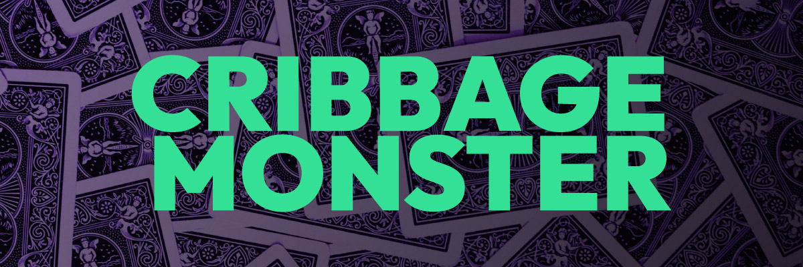

[![Contributors][contributors-shield]][contributors-url]
[![Forks][forks-shield]][forks-url]
[![Stargazers][stars-shield]][stars-url]
[![Issues][issues-shield]][issues-url]
[![MIT License][license-shield]][license-url]
[![LinkedIn][linkedin-shield]][linkedin-url]

<!-- PROJECT LOGO -->
 

  
    

      A two player online version of the classic card game.
     
     
    

  <h3 align="center">
    <a href="https://cribbage.netlify.app/" target="blank">
      Explore a live demo here »
    </a>
  </h3>

  

    A two player online version of the classic card game.
     
     
    Thanks for giving this project a star! ⭐️
     
    <a href="https://github.com/ChrisCoastal/cribbage-monster/issues">Report Bug</a>
    ·
    <a href="https://github.com/ChrisCoastal/cribbage-monster/issues">Request Feature</a>
  

<!-- TABLE OF CONTENTS -->

  
Table of Contents

  <ol>
    <li>
      <a href="#about-the-project">About The Project</a>
      <ul>
        <li><a href="#built-with">Built With</a></li>
      </ul>
    </li>
    <li>
      <a href="#getting-started">Getting Started</a>
      <ul>
        <li><a href="#prerequisites">Prerequisites</a></li>
        <li><a href="#installation">Installation</a></li>
      </ul>
    </li>
    <li><a href="#Project">Usage</a></li>
    <li><a href="#roadmap">Roadmap</a></li>
    <li><a href="#contributing">Contributing</a></li>
    <li><a href="#license">License</a></li>
    <li><a href="#contact">Contact</a></li>
    <li><a href="#acknowledgments">Acknowledgments</a></li>
  </ol>

<!-- ABOUT THE PROJECT -->

## About The Project

[![Product Name Screen Shot][product-screenshot]](https://cribbage.netlify.app/)

(<a href="#top">back to top</a>)

### Built With

- [Typescript](https://www.typescriptlang.org/)
- [Vite](https://vitejs.dev/)
- [React 18](https://reactjs.org/)
- [Firebase](https://firebase.google.com/)
- [React Router 6.4](https://reactrouter.com/en/main)
- [Anime.js](https://animejs.com/)
- [Tailwind](https://tailwindcss.com/)

(<a href="#top">back to top</a>)

<!-- Play -->

## Play

  

Check out the live playable version at <a href="https://cribbage.netlify.app/" target="_blank">Cribbage Monster</a>.
Don't know how to play? Learn the <a href="https://cribbage.netlify.app/rules" target="_blank">Rules of Crib</a>.

## Project

### Inspiration

Cribbage Monster started with the idea of building a small app (as a holiday gift) that my Dad, brothers, and their families could pursue the family pasttime with.

(<a href="#top">back to top</a>)

<!-- ROADMAP -->

## Roadmap

There is still more work and ideas I would love to add (or go back and change 😅), but I'm happy with where it is at and excited to move my focus to other work.

- [x] block out pages and routing
- [x] Firebase auth
- [x] block out game play UI
- [x] game logic
- [x] read/write game and app context from Firebase backend
- [x] websocket state updates between game clients
- [x] game cleanup via cloud functions
- [x] flush out UI
- [ ] presence for users in game
- [ ] custom avatar illustrations
- [ ] expand game play options
- [ ] computer opponent(s)
- [ ] ... 🏁

See the [open issues](https://github.com/ChrisCoastal/cribbage-monster/issues) for a full list of proposed features (and known issues).

(<a href="#top">back to top</a>)

<!-- CONTRIBUTING -->

## Contributing

Contributions are what make the open source community such an amazing place to learn, inspire, and create. Any contributions you make are **greatly appreciated**.

If you have a suggestion that would make Cribbage Monster better, please fork the repo and create a pull request. You can also simply open an issue with the tag "enhancement".
Don't forget to give the project a star! Thanks again!

1. Fork the Project
2. Create your Feature Branch (`git checkout -b feature/AmazingFeature`)
3. Commit your Changes (`git commit -m 'Add some AmazingFeature'`)
4. Push to the Branch (`git push origin feature/AmazingFeature`)
5. Open a Pull Request

(<a href="#top">back to top</a>)

<!-- LICENSE -->

## License

Distributed under the MIT License. See `LICENSE.txt` for more information.

(<a href="#top">back to top</a>)

<!-- CONTACT -->

## Contact

ChrisCoastal: contactchriscoastal@gmail.com 🌊

Project Link: [https://github.com/ChrisCoastal/cribbage-monster](https://github.com/ChrisCoastal/cribbage-monster)

(<a href="#top">back to top</a>)

<!-- ACKNOWLEDGMENTS -->

## Acknowledgments

- Thanks to everyone that has put amazing amounts of work and skill into the libraries, packages, and other code that has made this project posible. 🙏
- Thanks to Dad and Grandpa for 🙏

(<a href="#top">back to top</a>)

<!-- MARKDOWN LINKS & IMAGES -->
<!-- https://www.markdownguide.org/basic-syntax/#reference-style-links -->

[contributors-shield]: https://img.shields.io/github/contributors/ChrisCoastal/cribbage-monster.svg?style=for-the-badge
[contributors-url]: https://github.com/ChrisCoastal/cribbage-monster/graphs/contributors
[forks-shield]: https://img.shields.io/github/forks/ChrisCoastal/cribbage-monster.svg?style=for-the-badge
[forks-url]: https://github.com/ChrisCoastal/cribbage-monster/network/members
[stars-shield]: https://img.shields.io/github/stars/ChrisCoastal/cribbage-monster.svg?style=for-the-badge
[stars-url]: https://github.com/ChrisCoastal/cribbage-monster/stargazers
[issues-shield]: https://img.shields.io/github/issues/ChrisCoastal/cribbage-monster.svg?style=for-the-badge
[issues-url]: https://github.com/ChrisCoastal/cribbage-monster/issues
[license-shield]: https://img.shields.io/github/license/ChrisCoastal/cribbage-monster.svg?style=for-the-badge
[license-url]: https://github.com/ChrisCoastal/cribbage-monster/blob/master/LICENSE.txt
[linkedin-shield]: https://img.shields.io/badge/-LinkedIn-black.svg?style=for-the-badge&logo=linkedin&colorB=555
[linkedin-url]: https://linkedin.com/in/christopher-allen-3194371b5
[product-screenshot]: src/assets/game-view-partial.jpg
